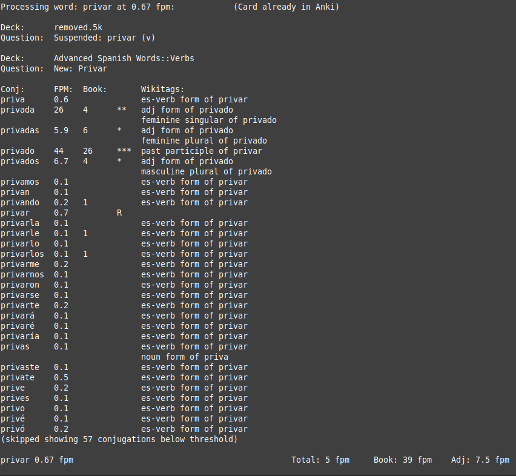

## Install:
 1. Download the Wiktionary dump and put it in the same directory as wordtree.py
   - Link: https://dumps.wikimedia.org/enwiktionary/latest/enwiktionary-latest-pages-articles-multistream.xml.bz2
   - Warning! This is a BIG file ≈ 2GB
 2. Choose your language and run with: ./wordtree.py --lang (abbreviation) (Language Name)
   - For example to choose Spanish you would run the program with: `./wordtree.py --lang es Spanish`
   - The 2 digit lang code must match the language. You can look up additional [language codes here](https://en.wikipedia.org/wiki/List_of_ISO_639-1_codes)
   - The first run will take many minutes to scan the entire 2 Gigabyte Wiktionary dump file and process it into a sqlite3 database inside the cache folder. After that, the program will start in a few seconds everytime, unless you run it with a different language code.

**Windows Instructions**

Windows users will want to open a powershell and type: `python3 -X utf8 ./wordtree.py`
If you don't have Python3 yet, you can [download it from python.org](https://www.python.org/downloads/windows/)
The `-X utf8` is required for Windows if your Python version is under [3.15](https://peps.python.org/pep-0686/)!

You won't be able to input non-ascii characters like **言葉** in powershell, until you change the font to "MS Gothic". [Instructions here.](https://learn.microsoft.com/en-us/troubleshoot/windows-server/system-management-components/powershell-console-characters-garbled-for-cjk-languages)

Note: I have only thoroughly tested this in Linux. If it breaks in Windows or Mac, give me the error output and I'll try to fix it.

## Usage:

Detailed help can be found by running `./wordtree.py --help`

In the meantime, here are some common ways to use it:

**Manual Mode**

 * You can input individual words by just running ./wordtree.py in the terminal
 * It will attempt to autocorrect words missing diacritics. For example, it will convert organico to orgánico or tamano to tamaño. (Requires pip install Unidecode)

**Inputing a list of words**

 Word lists can be in csv format, text or the "My Clippings.txt" from kindle E-reader
 * One word per line
 * Words cannot have any spaces in them.
 * I have not tested any other Kindle's format besides my own. Let me know if it works or not for you and what version kindle you have.

 Usage: `./wordtree.py your_word_list.txt`

**Comparing words with anki**

Usage: `--anki (database location)`

Checks to see if the words exist in your anki database, and prints matching cards. I find this useful to make sure I don't try to add the same card twice. The anki database is read in read only mode. If the database is busy (because you are using the anki app), it will switch to reading a cached version (if available). Closing anki should solve this problem and give you the most up-to-date copy of your cards.

Here are the locations of the anki databases.

 * Windows: %APPDATA%\Anki2
 * MacOS: ~/Library/ApplicationSupport/Anki2
 * Linux: ~/.local/share/Anki2

**Compare words against a book**

Usage: `--book bookname.txt`

Optionally, you can compare the frequency of words against a book.

 * This must be a .txt file, not a .mobi, .pdf or any kind of e-reader format.
 * It will automatically strip punctuation from any words found. Such as if a word ends in a comma, "quotation mark" or period.

**Star words**

Usage: `--nostars`

Sometimes words have multiple meanings. For example "privado" means private, not just the past participle of "privar", so it’s fpm is way too high.

By eliminating the star words, I have it reporting privar at a total of 5 fpm vs 88 with all the star words.

In this example, privado has 3 stars meaning that it's fpm is much too high to be included in the total fpm for privar. The more stars, the more ridiculous the discrepancy.

**More Features**

 Control how the output is sorted, set minimum and maximum fpms, output to csv and more.

 See additional help by running `./wordtree.py --help`

**Known bugs**

Arabic columns columns are being displayed backwards? It seems to work, but I need an arabic speaker/learner to confirm if this output makes any sense. The same goes for all of the other less common languages. I have tested it's output in English and Spanish, but I would appreciate if other language speakers could tell me if the program works for their language of choice.

## Data sources:

 **Frequency List**

 The frequency lists are from the OpenSubtitle Project: https://opus.nlpl.eu/OpenSubtitles/corpus/version/OpenSubtitles

 Tokenization was done here: https://github.com/hermitdave/FrequencyWords

 It's authorized under the `CC-by-sa-4.0` license. I have compressed the 2018 files and removed words with less than 3 hits in the corpus to save space and improve loading times.
