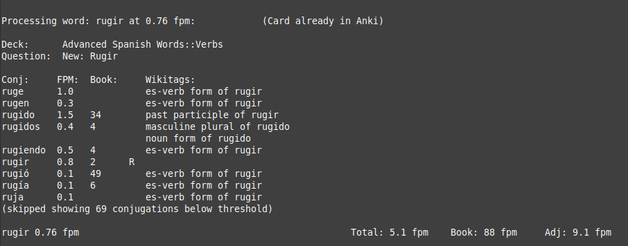

## Install:
 1. Download the Wiktionary dump and put it in the same directory as wordtree.py
   - Link: https://dumps.wikimedia.org/enwiktionary/latest/enwiktionary-latest-pages-articles-multistream.xml.bz2
   - Warning! This is a BIG file ≈ 2GB
 2. Choose your language and run with: ./wordtree.py --lang (abbreviation) (Language Name)
   - For example to choose Spanish you would run the program with: `./wordtree.py --lang es Spanish`
   - The 2 digit lang code must match the language. You can look up additional language codes [here](https://en.wikipedia.org/wiki/List_of_ISO_639-1_codes)

   - The first run will take many minutes to scan the entire wiktionary dump and process it into a database inside the cache folder. After that, the program will start in a few seconds everytime unless you run it with a different language code.

** Windows Instructions **
Windows users will want to open a powershell and type: `python3 -X utf8 ./wordtree.py`
If you don't have python3 yet, here are installation instructions: https://docs.python.org/3/using/windows.html
The `-X utf8` is required for Windows if your Python version is under 3.15!

Note: I have only throughly tested this in Linux. If it breaks in Windows or Mac, give me the error output and I'll try to fix it.

## Usage:

Detailed help can be found by running `./wordtree.py --help`

In the meantime, here are some common ways to use it:

**Manual Mode**

 * You can input individual words by just running ./wordtree.py in the terminal
 * It will attempt to autocorrect words missing diacritics. For example, it will convert organico to orgánico or tamano to tamaño.

**Inputing a list of words**

 Word lists can be in csv format, text or the "My Clippings.txt" from kindle E-reader
 * One word per line
 * Words cannot have any spaces in them.
 * I have not tested any other Kindle's format besides my own. Let me know if it works or not for you and what version kindle you have.

 Usage: ./wordtree.py your_word_list.txt

**Comparing words with anki**

Checks to see if the words exist in your anki database, and prints matching cards. I find this useful to make sure I don't try to add the same card twice. The anki database is read in read only mode. If the database is busy (because you are using the anki app), it will switch to reading a cached version (if available). Closing anki should solve this problem and give you the most up-to-date copy of your cards.

Here are the locations of the anki databases.

 * Windows: %APPDATA%\Anki2
 * MacOS: ~/Library/ApplicationSupport/Anki2
 * Linux: ~/.local/share/Anki2

**Compare words against a book**

Optionally, you can compare the frequency of words against a book.

 * This must be a .txt file, not a .mobi, .pdf or any kind of e-reader format.
 * It will automatically strip punctuation from any words found. Such as if a word ends in a comma, "quotation mark" or period.

**More Features**

 Control how the output is sorted, set minimum and maximum fpms, output to csv and more.

 See additional help by running ./wordtree.py --help

## Data sources:

 **Frequency List**

 The frequency lists are from the OpenSubtitle Project: http://opus.nlpl.eu/OpenSubtitles2018.php

 Tokenization was done here: https://github.com/hermitdave/FrequencyWords

 It's authorized under the CC-by-sa-4.0 license. I have compressed the 2018 files and removed words with less than 3 hits in the corpus to save space and improve loading times.
